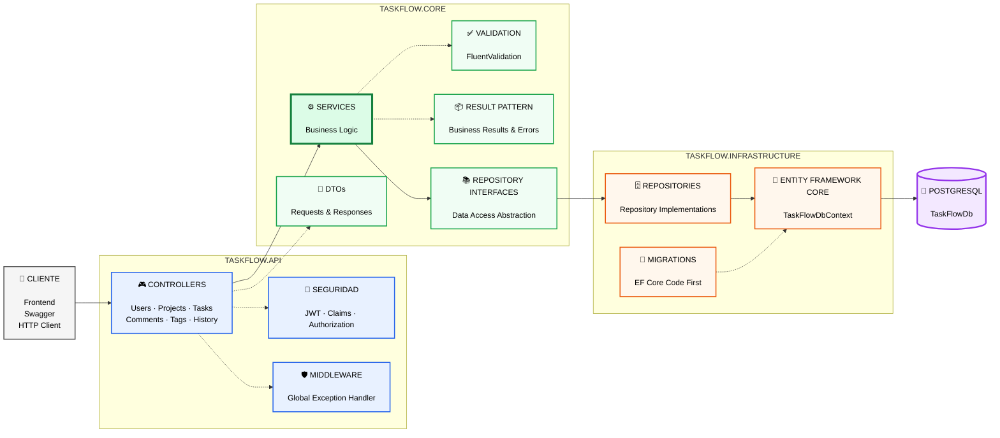
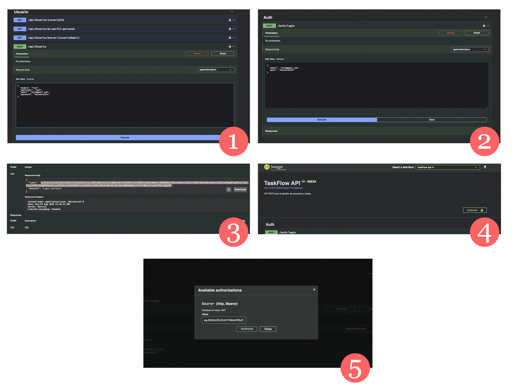
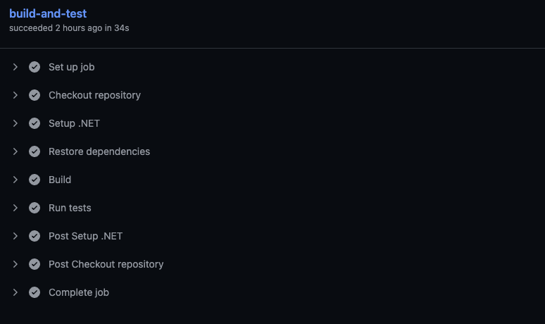
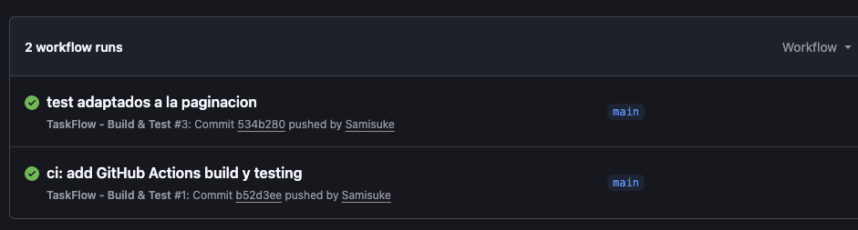

<div align="center">

# TaskFlow

### API REST para la gestión de proyectos y tareas

Una aplicación backend moderna desarrollada con **ASP.NET Core**, siguiendo principios de **Clean Architecture** y buenas prácticas de desarrollo.

<br>

[](https://dotnet.microsoft.com/)
[](https://learn.microsoft.com/aspnet/core/)
[](https://learn.microsoft.com/ef/core/)
[](https://www.postgresql.org/)
[](https://www.docker.com/)
[](https://github.com/features/actions)

</div>

<!-- Banner -->

---

## 📌 Acerca del proyecto

**TaskFlow** es una API REST orientada a la gestión de proyectos y tareas, desarrollada con **ASP.NET Core** y diseñada siguiendo principios de **Clean Architecture**.

El proyecto busca demostrar cómo construir una aplicación backend moderna manteniendo una separación clara de responsabilidades entre la API, la lógica de aplicación y la infraestructura.

Además de la funcionalidad principal, TaskFlow incorpora diferentes aspectos habituales en el desarrollo backend profesional:

* 🔐 Autenticación mediante JWT
* 🛡️ Autorización basada en roles y permisos
* ✅ Validación de peticiones
* 🗒️ Paginación
* 🗄️ Persistencia con Entity Framework Core y PostgreSQL
* ⚠️ Gestión centralizada de excepciones
* 🧪 Tests automatizados
* 🐳 Entorno containerizado con Docker
* ⚙️ Integración continua mediante GitHub Actions
* 📖 Documentación interactiva mediante Swagger / OpenAPI

El objetivo no es únicamente construir una API funcional, sino aplicar principios que permitan mantener el proyecto **organizado, testeable y preparado para evolucionar**.

## ✨ Características principales

### 📋 Gestión de proyectos

* Creación y gestión de proyectos
* Gestión de miembros
* Gestión de roles dentro del proyecto
* Control de acceso a los recursos del proyecto

### ✅ Gestión de tareas

* Creación y gestión de tareas
* Asignación de tareas
* Estados y prioridades
* Fechas límite
* Etiquetas
* Paginación

### 💬 Gestión de comentarios

* Creación y edición de comentarios
* Comentarios asociados a tareas
* Consulta de comentarios por usuario
* Paginación

### 🏷️ Gestión de etiquetas

* Asociación de etiquetas a tareas
* Gestión de etiquetas durante la creación y modificación de tareas

### 👤 Gestión de usuarios

* Crear usuario
* Obtener usuario por ID
* Obtener perfil propio
* Buscar usuario por email
* Modificación del perfil
* Cambiar contraseña
* Gestión de usuarios activos/inactivos
* Contraseñas almacenadas encriptadas con BCrypt

### 📋 Historial

TaskFlow registra los cambios relevantes realizados dentro de los proyectos,
manteniendo un histórico de las operaciones realizadas para facilitar la
trazabilidad de las modificaciones.

### 🔐 Autenticación

La API utiliza **JWT Bearer Authentication** para proteger los recursos que requieren autenticación.

* Autenticación de usuarios
* Generación de tokens JWT
* Endpoints protegidos
* Autenticación mediante Bearer Token

### 🛡️ Autorización

La autorización se gestiona de forma independiente a la autenticación para determinar qué operaciones puede realizar cada usuario.

* Control de acceso a recursos
* Protección de operaciones
* Control de acceso basado en la pertenencia al proyecto
* Roles específicos dentro de cada proyecto

### ✅ Validación

Las peticiones son validadas antes de llegar a la lógica de aplicación mediante
**FluentValidation**.

Además, la capa de servicios aplica las reglas de negocio necesarias para
comprobar que las operaciones solicitadas sean válidas y que el usuario tenga
los permisos necesarios para ejecutarlas.


### ⚠️ Gestión de errores

TaskFlow incorpora middleware para gestionar las excepciones de forma centralizada.

### 📦 Result Pattern

Los servicios utilizan un tipo `Result` para representar de forma explícita
el resultado de las operaciones y los errores esperados de la lógica de negocio,
evitando utilizar excepciones como mecanismo de control del flujo normal de la aplicación.

### 📖 Documentación de la API

La API está documentada mediante **Swagger**, permitiendo explorar y probar los endpoints directamente desde el navegador.

### 🔒 Seguridad
* JWT Bearer Authentication
* Protección de endpoints mediante `[Authorize]`
* Identificación del usuario mediante claims del JWT
* Hashing de contraseñas mediante BCrypt
* Control de acceso según pertenencia al proyecto
* Roles dentro de los proyectos
* Validación de cuentas activas/inactivas
* Comprobación de contraseña actual antes de cambiarla

### 📄 Paginación

Los endpoints que devuelven colecciones incorporan paginación para controlar
el volumen de datos devuelto por la API.

Las respuestas incluyen información como:

* Elementos de la página actual
* Número total de elementos
* Número total de páginas
* Tamaño de página

### 🔄 DTOs y mapeo

La API utiliza DTOs para separar los contratos HTTP de las entidades de
persistencia. Mapster se utiliza para realizar el mapeo entre entidades y DTOs,
reduciendo el acoplamiento entre las diferentes capas.

---

# 🚀 Puesta en marcha

## Requisitos previos

Antes de ejecutar TaskFlow necesitas tener instalado:

* [.NET 10 SDK](https://dotnet.microsoft.com/)
* [Docker](https://www.docker.com/)
* Docker Compose
* [Git](https://git-scm.com/)

## 1. Clonar el repositorio

```bash
git clone https://github.com/Samisuke/TaskFlow.git
cd TaskFlow
```

## 2. Ejecutar con Docker

La forma recomendada para iniciar el entorno local es:

```bash
docker compose up --build -d
```

Esto levantará los servicios necesarios para ejecutar TaskFlow.

### 🗄️ Base de datos y migraciones

TaskFlow utiliza **Entity Framework Core Code First** junto con PostgreSQL.

Las migraciones de Entity Framework Core están versionadas dentro de
`TaskFlow.Infrastructure/Migrations`.

Al iniciar la aplicación, las migraciones pendientes se aplican automáticamente
mediante `Database.Migrate()`.

De esta forma, al clonar el proyecto y ejecutar Docker Compose, la base de datos
queda preparada automáticamente sin necesidad de ejecutar manualmente
`dotnet ef database update`.

---

# 🛠️ Tecnologías utilizadas

## Backend

| Tecnología                | Uso                       |
| ------------------------- | ------------------------- |
| **C#**                    | Lenguaje principal        |
| **.NET 10**               | Framework de desarrollo   |
| **ASP.NET Core**          | Desarrollo de la API REST |
| **Entity Framework Core** | ORM y acceso a datos      |
| **PostgreSQL**            | Base de datos relacional  |
| **JWT Bearer**            | Autenticación             |
| **FluentValidation**      | Validación de peticiones  |
| **Mapster**               | Mapeo entre objetos       |
| **NSubstitute**           | Mocking de dependencias   |
| **FluentAssertions**      | Assertions de tests       |
| **Swagger / OpenAPI**     | Documentación de la API   |

## Infraestructura y herramientas

| Tecnología         | Uso                   |
| ------------------ | --------------------- |
| **Docker**         | Containerización      |
| **Docker Compose** | Entorno de desarrollo |
| **GitHub Actions** | Integración continua  |
| **xUnit**          | Tests automatizados   |

---

# 🎯 Objetivos técnicos

TaskFlow ha sido desarrollado con varios objetivos técnicos:

* Aplicar principios de **Clean Architecture**.
* Mantener una separación clara de responsabilidades.
* Implementar autenticación y autorización mediante **JWT**.
* Gestionar la persistencia mediante **Entity Framework Core y PostgreSQL**.
* Incorporar validación de peticiones con **FluentValidation**.
* Centralizar la gestión de excepciones mediante middleware.
* Mantener la lógica de negocio separada de la infraestructura.
* Crear tests automatizados para las diferentes áreas de la aplicación.
* Facilitar el entorno de desarrollo mediante **Docker Compose**.
* Automatizar la compilación y ejecución de tests mediante **GitHub Actions**.

---

# 🏗️ Arquitectura

TaskFlow sigue una arquitectura inspirada en los principios de **Clean Architecture**, buscando mantener una separación clara entre las diferentes responsabilidades de la aplicación.



## TaskFlow.Api

Capa responsable de exponer la API HTTP y gestionar los aspectos relacionados con la comunicación con el exterior.

Incluye:

* Controllers
* Middleware
* Configuración de autenticación
* Configuración de Swagger
* Dependency Injection
* Configuración general de la aplicación

## TaskFlow.Core

Contiene las abstracciones y la lógica principal de la aplicación.

Incluye:

* Modelos
* DTOs
* Servicios
* Interfaces
* Repositorios
* Validadores
* Lógica de aplicación

Esta capa intenta mantenerse independiente de los detalles concretos de infraestructura.

## TaskFlow.Infrastructure

Contiene las implementaciones relacionadas con infraestructura y servicios externos.

Incluye:

* Entity Framework Core
* DbContext
* PostgreSQL
* Implementaciones de repositorios
* Migraciones
* Servicios de infraestructura

Esta separación permite modificar detalles de infraestructura sin tener que introducirlos directamente en la lógica principal de la aplicación.

---

# 📡 Ejemplos de API

La API puede explorarse y probarse mediante la interfaz de **Swagger / OpenAPI**. Una vez arrancada la API, entrar en el navegador y entrar en la dirección **http://localhost:8080/swagger/index.html**


## Autenticación

1. Crea un usuario.
2. Inicia sesión.
3. Copia el token JWT para autorizarte.
4. Accede a cualquier endpoint protegido y pruébalo.



---

# 🧪 Testing

TaskFlow cuenta con un proyecto independiente de tests que combina pruebas unitarias y pruebas de integración, con el objetivo de detectar regresiones y verificar el comportamiento de los principales componentes y flujos de la aplicación.

### Tests unitarios
* Tests de servicios.
* Tests de reglas de negocio.
* Tests de permisos y autorización.
* Tests de escenarios correctos y erróneos.
* Helpers y utilidades de testing.
Para estas pruebas se utilizan xUnit, FluentAssertions y NSubstitute.

### Tests de integración
* ASP.NET Core WebApplicationFactory para levantar la aplicación en un entorno de pruebas.
* HttpClient para realizar peticiones contra la API.
* Testcontainers para ejecutar una instancia temporal de PostgreSQL mediante Docker.
* Entity Framework Core para aplicar las migraciones y trabajar con la base de datos de pruebas.
* Un sistema de autenticación específico para testing que permite simular diferentes usuarios y comprobar escenarios de autenticación y autorización.
* La base de datos se restablece entre las pruebas de integración para garantizar que cada escenario parte de un estado conocido y aislado.

### Entre los escenarios probados se incluyen:
* Obtención de proyectos del usuario autenticado.
* Filtrado de proyectos según la pertenencia del usuario.
* Usuarios sin proyectos.
* Control de acceso a proyectos mediante autorización.
* Respuestas 403 Forbidden cuando un usuario intenta acceder a recursos a los que no tiene acceso.
* Persistencia y consulta de datos utilizando PostgreSQL.
* Autenticación de diferentes usuarios durante las pruebas.
* Aplicación de migraciones de Entity Framework Core sobre la base de datos de pruebas.

### Ejecutar los tests

```bash
dotnet test
```

### Restaurar, compilar y ejecutar tests

```bash
dotnet restore
dotnet build
dotnet test
```

---

# 🐳 Docker

El entorno está compuesto por:
* API: TaskFlow API ASP.NET Core
* DB: PostgreSQL Database

TaskFlow incluye una configuración de **Docker Compose** para facilitar la ejecución de la API junto con PostgreSQL.

PostgreSQL dispone de un **health check**, permitiendo comprobar que la base de datos está disponible antes de que la API dependa de ella.

### Iniciar el entorno

```bash
docker compose up --build -d
```

### Detener el entorno

```bash
docker compose down
```


---

# ⚙️ Integración continua

TaskFlow utiliza **GitHub Actions** para automatizar las comprobaciones básicas del proyecto.

Actualmente el workflow realiza:

1. Restauración de dependencias
2. Compilación en modo Release
3. Ejecución de tests

 

Esto permite detectar automáticamente errores de compilación o tests fallidos durante el desarrollo.

---

# 💡 Decisiones técnicas

Uno de los objetivos principales de TaskFlow es demostrar que el desarrollo de una API no consiste únicamente en crear endpoints, sino también en tomar decisiones que faciliten el mantenimiento y evolución del proyecto.

### 🏗️ Clean Architecture

La separación entre API, Core e Infrastructure permite mantener las responsabilidades claramente delimitadas y reducir el acoplamiento entre componentes.

### 💉 Dependency Injection

Se utiliza el sistema de **Dependency Injection** integrado en ASP.NET Core para registrar y resolver las diferentes dependencias de la aplicación.

### 📦 Repository Pattern

El acceso a datos se abstrae mediante repositorios, evitando acoplar directamente la lógica de aplicación a Entity Framework Core.

### 🧠 Separación de responsabilidades

Los controllers se mantienen centrados en la comunicación HTTP, mientras que los servicios contienen la lógica de aplicación y los repositorios gestionan el acceso a datos.

### 🔄 Separación entre Controllers y Services

Los controllers se encargan únicamente de recibir las peticiones HTTP,
validar los datos de entrada y devolver las respuestas correspondientes.

La lógica de negocio se mantiene en los servicios, evitando que los controllers
contengan reglas de negocio y facilitando su testing independiente.

### ⚠️ Gestión centralizada de excepciones

El middleware global permite gestionar errores desde un único punto y mantener un comportamiento consistente en toda la API.

### ✅ Validación

FluentValidation permite separar las reglas de validación de los controllers y mantenerlas organizadas.

### 🧪 Testing

La existencia de un proyecto de tests independiente permite validar diferentes partes de la aplicación y reducir el riesgo de regresiones.

### 🐳 Containerización

Docker Compose permite disponer de un entorno de desarrollo reproducible y simplifica la ejecución de la API junto con PostgreSQL.

---

<div align="center">

### Samuel Secanella

Desarrollador backend enfocado en el ecosistema .NET.

[](https://github.com/Samisuke)

</div>
